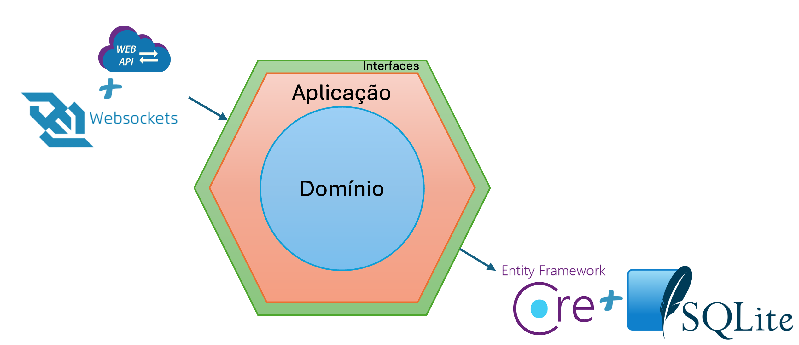
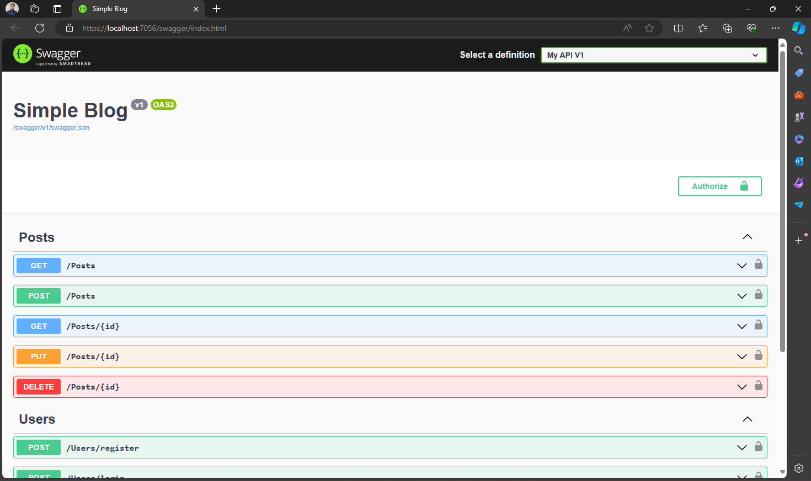
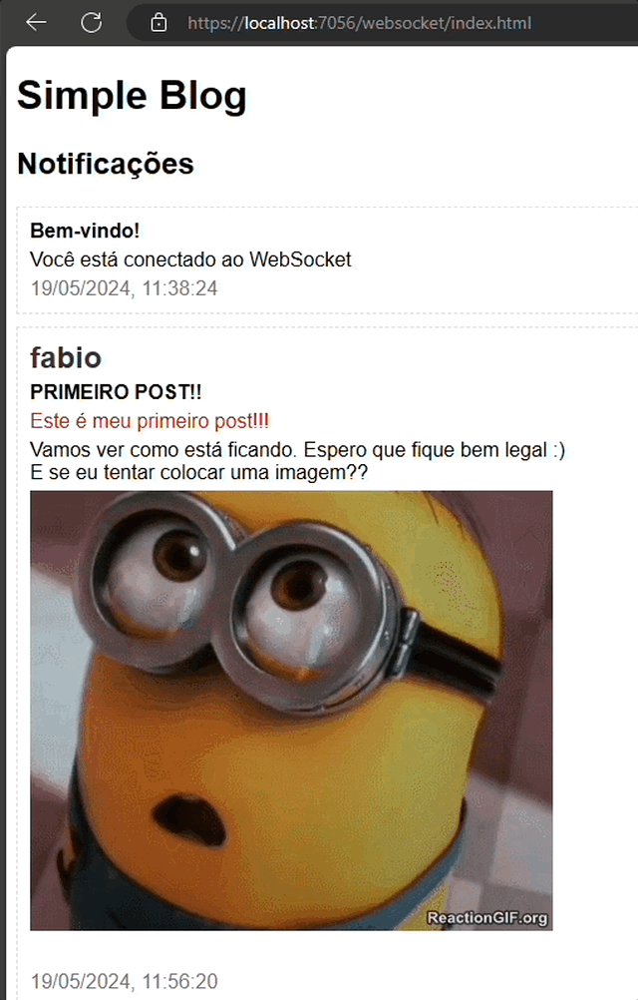

# SimpleBlog

[Sobre](#sobre-o-projeto) | [Requisitos](#requisitos-do-projeto) | [Arquitetura](#arquitetura) | [Estrutura](#estrutura-do-projeto) | [Testes](#testes) | [WebSockets](#websockets) | [Swagger](#swagger) | [Página Estática](#página-estática) | [Autenticação](#autenticação) | [Configuração](#configuração) | [Como usar](#como-usar) | [Endpoints](#endpoints)


## Sobre o Projeto

O SimpleBlog é um projeto de blog simples que utiliza a arquitetura Hexagonal (Ports and Adapters), Domain-Driven Design (DDD), os princípios SOLID e Clean Code.

<sup>[Voltar para o inicio](#simpleblog)</sup>

## Requisitos do Projeto

O projeto foi construído com os seguintes requisitos em mente:

- **Autenticação**: Usuários devem ser capazes de se registrar e fazer login.
- **Gerenciamento de Postagens**: Os usuários autenticados podem criar postagens, editar suas próprias postagens e excluir postagens existentes.
- **Visualização de Postagens**: Qualquer visitante do site pode visualizar as postagens existentes.
- **Notificações em Tempo Real**: Implemente um sistema de notificação em tempo real usando WebSockets para informar os usuários sobre novas postagens assim que são publicadas.

<sup>[Voltar para o inicio](#simpleblog)</sup>

## Arquitetura

### Hexagonal

A arquitetura Hexagonal, também conhecida como Ports and Adapters, permite que a lógica de negócios seja isolada e testada independentemente de coisas como banco de dados e UI. Isso é feito através da definição de contratos claros e separação de responsabilidades.




### Domain-Driven Design

O Domain-Driven Design (DDD) é uma abordagem para o desenvolvimento de software que se concentra no domínio do problema, promovendo uma melhor compreensão do problema que estamos tentando resolver.

### SOLID

Os princípios SOLID são um conjunto de princípios de design orientado a objetos que ajudam a tornar o software mais compreensível, flexível e sustentável.

### Clean Code

Clean Code é uma disciplina de desenvolvimento que se concentra em manter o código simples, legível e fácil de manter.

<sup>[Voltar para o inicio](#simpleblog)</sup>

## Estrutura do Projeto

O projeto é dividido em várias camadas, cada uma com uma responsabilidade específica.

```
SimpleBlog
├── SimpleBlog.Application
│   ├── DTOs
│   ├── Interfaces
│   ├── Mappers
│   └── Services
├── SimpleBlog.Domain
│   ├── Entities
│   ├── Enums
│   ├── Exceptions
│   ├── Interfaces
│   └── ValueObjects
├── SimpleBlog.Persistence
│   ├── Configurations
│   ├── Context
│   ├── Interfaces
│   ├── Migrations
│   └── Repositories
└── SimpleBlog.Web.API
    ├── Properties
    ├── wwwroot
    ├── Controllers
    ├── Filters
    ├── Interfaces
    ├── Mappers
    ├── Services
    └── ViewModels
```

### SimpleBlog.Application

Esta camada contém a lógica de aplicação e é responsável por coordenar as operações entre a camada de domínio e a camada de persistência. Ela contém DTOs (Data Transfer Objects), interfaces para serviços, mapeadores para converter entre entidades e DTOs, e serviços que implementam a lógica de negócios.

### SimpleBlog.Domain

Esta é a camada de domínio, que contém todas as entidades, enums, exceções, interfaces e objetos de valor que definem o domínio do negócio. Esta camada é onde a maior parte da lógica de negócios reside.

### SimpleBlog.Persistence

A camada de persistência é responsável por interagir com o banco de dados. Ela contém configurações para o Entity Framework, o contexto do banco de dados, interfaces para os repositórios, migrações do banco de dados e implementações dos repositórios.

### SimpleBlog.Web.API

Esta é a camada de apresentação, que contém a API web. Ela contém controllers para lidar com solicitações HTTP, filtros para lidar com aspectos transversais como tratamento de erros, interfaces para serviços, mapeadores para converter entre DTOs e ViewModels, serviços para lógica específica da API, e ViewModels para dados enviados para o cliente. Esta camada também implementa a funcionalidade WebSocket para comunicação em tempo real.

<sup>[Voltar para o inicio](#simpleblog)</sup>

## Testes

Os testes são uma parte essencial do projeto SimpleBlog.

Continuando com a estrutura do projeto. Cada camada da arquitetura tem um projeto de teste dedicado:

```
SimpleBlog
├── SimpleBlog.Application.Tests
├── SimpleBlog.Domain.Tests
├── SimpleBlog.Persistence.Tests
└── SimpleBlog.Web.API.Tests
```

Essa separação de testes por camada permite testar cada parte do código de forma isolada. Além disso, essa separação de testes também é alinhada com os princípios *SOLID*, especificamente o Princípio da Segregação de Interface (ISP).

Para facilitar os testes, todas as classes concretas foram tratadas com interfaces. Isso permite que os testes sejam feitos sem problemas de dependências, pois você pode criar mockups das interfaces usando uma biblioteca como o `Moq`.

Os testes foram escritos usando o `NUnit`, um framework de testes unitários para .NET. Aqui está um exemplo de como um teste pode ser estruturado usando NUnit e Moq:

```csharp
[Test]
public void TestMethod()
{
    // Arrange
    var mockService = new Mock<IMyService>();
    mockService.Setup(service => service.DoSomething()).Returns(true);
    var controller = new MyController(mockService.Object);

    // Act
    var result = controller.Action();

    // Assert
    Assert.IsTrue(result);
}
```

<sup>[Voltar para o inicio](#simpleblog)</sup>

## WebSockets

O projeto utiliza WebSockets para fornecer uma comunicação em tempo real entre o servidor e o cliente. O principal objetivo dessa funcionalidade é informar, em tempo real, todos os clientes conectados sobre novas postagens no blog0. Isso é feito através do uso do `WebSocketHandler`, `WebSocketManagerService` e `WebSocketHandlerFactory`.

Aqui está um exemplo de como você pode se conectar ao WebSocket a partir do cliente:

```javascript
var socket = new WebSocket("ws://localhost:5000/ws");

socket.onopen = function(event) {
  console.log("Conexão aberta");
};

socket.onmessage = function(event) {
  console.log("Mensagem recebida: " + event.data);
};

socket.onclose = function(event) {
  console.log("Conexão fechada");
};
```

<sup>[Voltar para o inicio](#simpleblog)</sup>

## Swagger

O projeto utiliza o Swagger para documentação da API. Você pode acessar a documentação da API visitando `/swagger/index.html` no seu navegador.



<sup>[Voltar para o inicio](#simpleblog)</sup>

## Página Estática

O projeto também fornece uma página estática que pode ser usada para testar a conexão WebSocket. Você pode acessar esta página visitando `/websocket/index.html` no seu navegador.



<sup>[Voltar para o inicio](#simpleblog)</sup>

## Autenticação

### Registro

Para se registrar, você deve enviar uma solicitação POST para o endpoint `/Users/register` com o seguinte corpo de solicitação:

```json
{
    "username": "exemplo",
    "password": "exemplo"
}
```


### Login

Para fazer login, você deve enviar uma solicitação POST para o endpoint `/Users/login` com o seguinte corpo de solicitação:

```json
{
    "username": "exemplo",
    "password": "exemplo"
}
```
Se o login for bem-sucedido, o servidor retornará um token JWT.
```json
{
  "token": "<token>"
}
```

### Uso do Token

Após o registro bem-sucedido ou login, o servidor retornará um token JWT. Este token deve ser incluído no cabeçalho `Authorization` de todas as solicitações subsequentes que requerem autenticação. O cabeçalho deve ter o seguinte formato: `Authorization: Bearer <token>`.

<sup>[Voltar para o inicio](#simpleblog)</sup>

## Configuração

Os segredos do aplicativo, como a chave secreta do JWT, estão configurados no arquivo `appsettings.json`. Por motivos de segurança, é recomendado que esses segredos sejam armazenados em um local seguro, como um Azure Key Vault, em vez de serem incluídos diretamente no arquivo `appsettings.json`.

```json
{
  "UserSecret": "Substituir por um keyvalt.",
  "Jwt": {
    "Key": "Também substituir por um keyvalt, não é seguro deixar fixo aqui."
  }
}
```

O caminho para o WebSocket também é configurado no arquivo `appsettings.json`:

```json
{
  "WebSocket": {
    "Path": "/ws"
  }
}
```

Este é o caminho que você deve usar ao se conectar ao WebSocket a partir do cliente.

<sup>[Voltar para o inicio](#simpleblog)</sup>

## Como usar

Para usar o projeto, você precisa ter o .NET 6.0 instalado. Você pode então clonar o repositório e executar o projeto usando o comando `dotnet run` no diretório raiz do projeto.

<sup>[Voltar para o inicio](#simpleblog)</sup>

## Endpoints

### PostsController

#### GET /posts

Retorna todas as postagens do blog. Não requer autenticação.

| Código HTTP | Nome | Retorno |
| --- | --- | --- |
| 200 | OK | Retorna um array de postagens. |

Exemplo de resposta:

```json
[
  {
    "id": 1,
    "title": "Título do Post",
    "content": "Conteúdo do Post"
  },
  ...
]
```

#### GET /posts/{id}

Retorna uma postagem específica do blog com base no ID fornecido. Não requer autenticação.

| Código HTTP | Nome | Retorno |
| --- | --- | --- |
| 200 | OK | Retorna a postagem solicitada. |
| 404 | Not Found | A postagem não foi encontrada. Esta resposta é retornada quando uma `PostNotFoundException` é lançada. |

Exemplo de resposta:

```json
{
  "id": 1,
  "title": "Título do Post",
  "content": "Conteúdo do Post"
}
```

#### POST /posts

Cria uma nova postagem. Requer autenticação. O corpo da solicitação deve incluir os detalhes da postagem.

| Código HTTP | Nome | Retorno |
| --- | --- | --- |
| 201 | Created | Retorna a postagem criada. |
| 401 | Unauthorized | A autenticação falhou. Esta resposta é retornada quando uma `UserNotAuthorizedException` é lançada. |
| 409 | Conflict | A postagem já existe. Esta resposta é retornada quando uma `PostConflictException` é lançada. |

Exemplo de corpo da solicitação:

```json
{
  "title": "Título do Post",
  "content": "Conteúdo do Post"
}
```

Exemplo de resposta:

```json
{
  "id": 1,
  "title": "Título do Post",
  "content": "Conteúdo do Post"
}
```

#### PUT /posts/{id}

Atualiza uma postagem existente. Requer autenticação. O corpo da solicitação deve incluir os detalhes atualizados da postagem.

| Código HTTP | Nome | Retorno |
| --- | --- | --- |
| 200 | OK | Retorna a postagem atualizada. |
| 401 | Unauthorized | A autenticação falhou. Esta resposta é retornada quando uma `UserNotAuthorizedException` é lançada. |
| 404 | Not Found | A postagem não foi encontrada. Esta resposta é retornada quando uma `PostNotFoundException` é lançada. |

Exemplo de corpo da solicitação:

```json
{
  "title": "Título Atualizado",
  "content": "Conteúdo Atualizado"
}
```

Exemplo de resposta:

```json
{
  "id": 1,
  "title": "Título Atualizado",
  "content": "Conteúdo Atualizado"
}
```

#### DELETE /posts/{id}

Exclui uma postagem existente. Requer autenticação.

| Código HTTP | Nome | Retorno |
| --- | --- | --- |
| 204 | No Content | A postagem foi excluída com sucesso. |
| 401 | Unauthorized | A autenticação falhou. Esta resposta é retornada quando uma `UserNotAuthorizedException` é lançada. |
| 404 | Not Found | A postagem não foi encontrada. Esta resposta é retornada quando uma `PostNotFoundException` é lançada. |

### UsersController

#### POST /users/register

Registra um novo usuário. O corpo da solicitação deve incluir o nome de usuário e a senha.

| Código HTTP | Nome | Retorno |
| --- | --- | --- |
| 201 | Created | Retorna o usuário criado. |
| 400 | Bad Request | A senha é inválida. Esta resposta é retornada quando uma `InvalidPasswordException` é lançada. |
| 409 | Conflict | O nome de usuário já existe. Esta resposta é retornada quando uma `UserAlreadyExistsException` é lançada. |

Exemplo de corpo da solicitação:

```json
{
  "username": "nome_de_usuario",
  "password": "senha"
}
```

Exemplo de resposta:

```json
{
  "id": 1,
  "username": "nome_de_usuario"
}
```

#### POST /users/login

Autentica um usuário. O corpo da solicitação deve incluir o nome de usuário e a senha. Se a autenticação for bem-sucedida, retorna um token JWT.

| Código HTTP | Nome | Retorno |
| --- | --- | --- |
| 200 | OK | Retorna o token JWT. |
| 401 | Unauthorized | A autenticação falhou. Esta resposta é retornada quando uma `UserNotAuthorizedException` é lançada. |
| 404 | Not Found | O usuário não foi encontrado. Esta resposta é retornada quando uma `UserNotFoundException` é lançada. |

Exemplo de corpo da solicitação:

```json
{
  "username": "nome_de_usuario",
  "password": "senha"
}
```

Exemplo de resposta:

```json
{
  "token": "token_jwt"
}
```

### WebSocketController

#### GET /ws

Estabelece uma conexão WebSocket se a solicitação for uma solicitação WebSocket. Caso contrário, retorna um status 400.

| Código HTTP | Nome | Retorno |
| --- | --- | --- |
| 101 | Switching Protocols | A conexão WebSocket foi estabelecida. |
| 400 | Bad Request | A solicitação não é uma solicitação WebSocket. |

#### GET /ws/close/{socketId}

Fecha uma conexão WebSocket com base no ID do socket fornecido.

| Código HTTP | Nome | Retorno |
| --- | --- | --- |
| 200 | OK | A conexão WebSocket foi fechada. |
| 404 | Not Found | O ID do socket não foi encontrado. |

<sup>[Voltar para o inicio](#simpleblog)<sup>